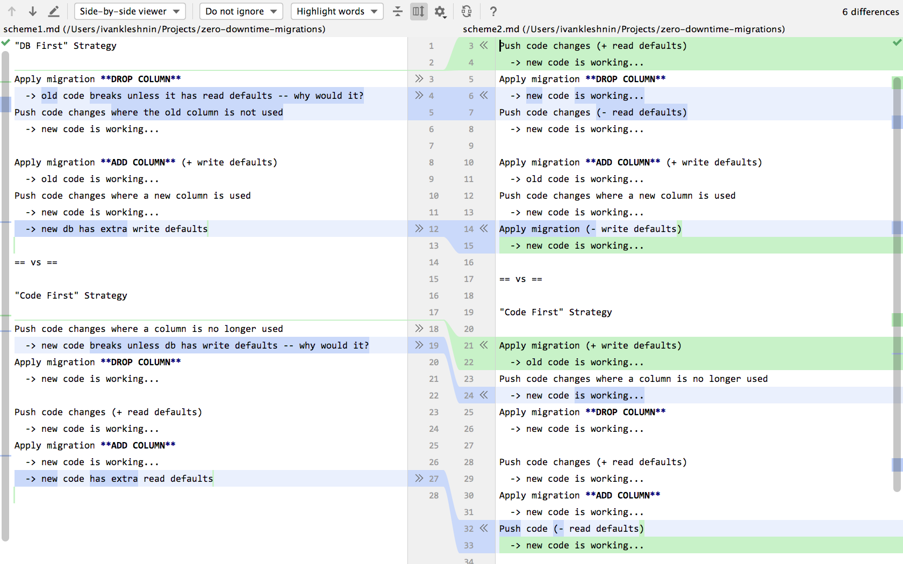

# Code-First vs DB-First DB migrations

Analysis of code-first and db-first migration/deployment strategies.
I recommend to fork the repo and compare the following files:

- [scheme-1.md](./scheme1.md)
- [scheme-2.md](./scheme2.md)
- [scheme-3.md](./scheme3.md)
- [scheme-4.md](./scheme4.md)

Pairwise: 

- [scheme-1.md](./scheme1.md) diff [scheme-2.md](./scheme2.md)
- [scheme-2.md](./scheme2.md) diff [scheme-3.md](./scheme3.md) 
- and so on...

More comments and guides will be (hopefully) added.

--

[Video Explanation (RU lang)](https://youtu.be/YsXJ29PFxPw).
